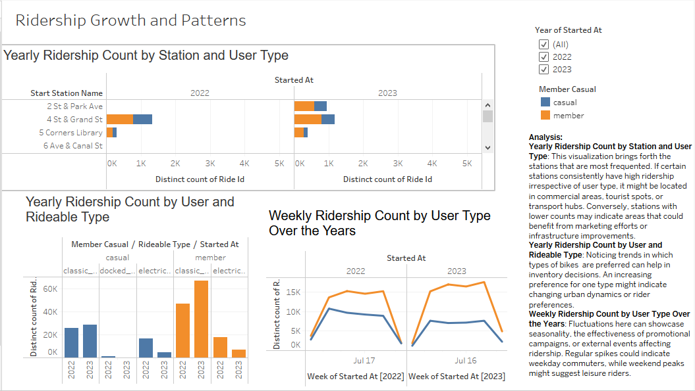
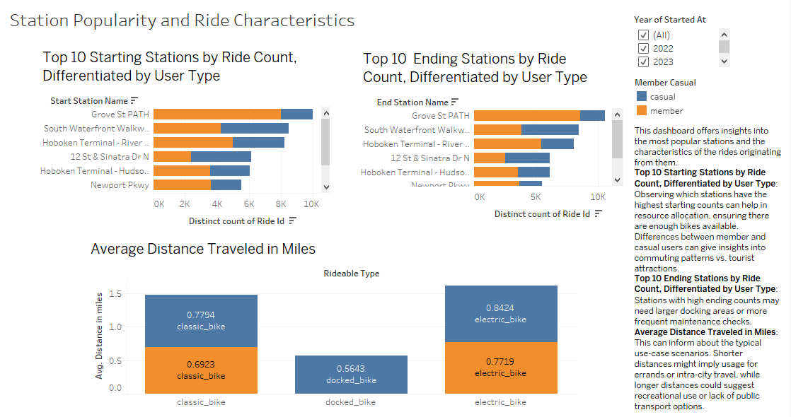
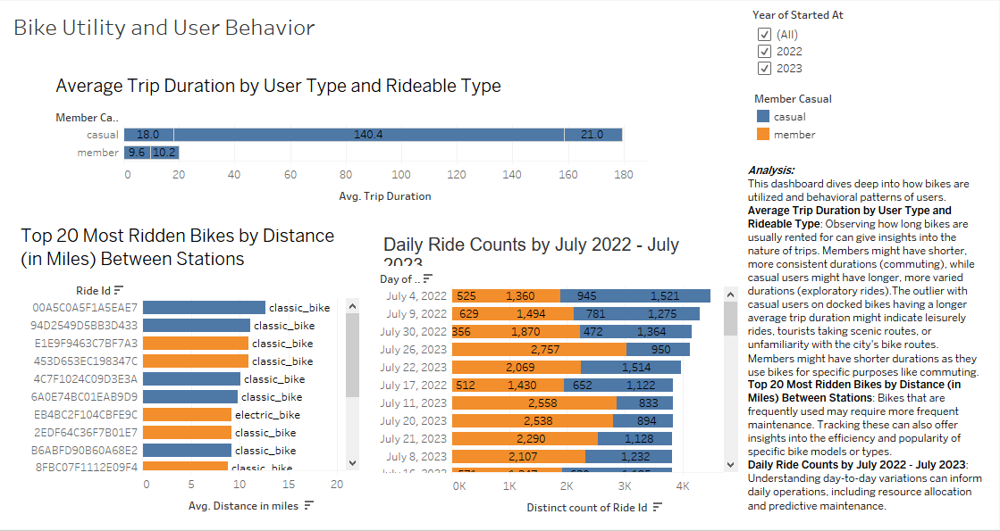
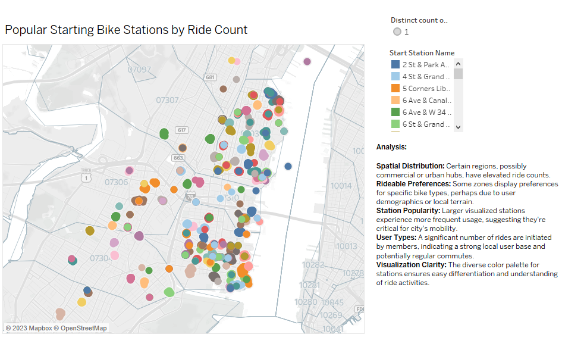
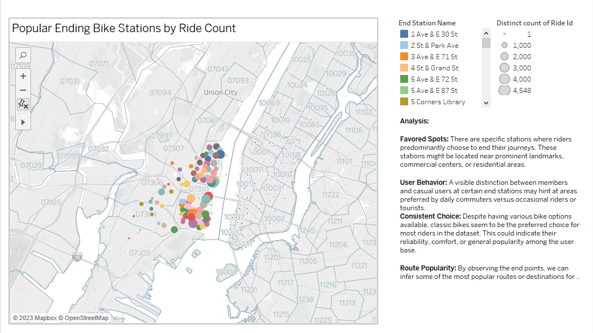
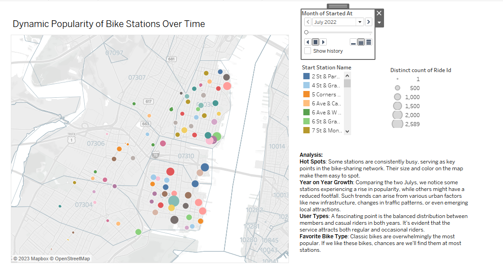

# tableau_challenge
Generate regular reports for city officials looking to publicize and improve the city program in the United States.

## Background

As the new lead analyst for the New York Citi Bike program, I am now responsible for overseeing the largest bike-sharing program in the United States. In my new role, I will be expected to generate regular reports for city officials looking to publicize and improve the city program.
Since 2013, the Citi Bike program has implemented a robust infrastructure for collecting data on the program's utilization. Each month, bike data is collected, organized, and made public on the Citi Bike Data 
However, while the data has been regularly updated, the team has yet to implement a dashboard or sophisticated reporting process. City officials have questions about the program, so my first task on the job is to build a set of data reports to provide the answers.

### Instructions
My task in this assignment is to aggregate the data found in the Citi Bike Trip History Logs and find unexpected phenomena.
1: Design 2–5 visualizations for each discovered phenomenon (4–10 total). I have the flexibility to work within a timespan of my preference. If needed, I can also combine multiple datasets from various periods.
Here are some questions I might want to address:

**Dashboard 1:** Ridership Growth and Patterns
Visualization 1: Yearly Ridership Count by Station and User Type:
- Which station consistently sees the highest ridership, and does user type (member vs. casual) influence this trend?
Visualization 2: Yearly Ridership Count by User and Rideable Type:
- How does the preference for rideable type differ between regular and casual users over the years?
  Visualization 3: Weekly Ridership Count by User Type Over the Years:
- Is there a specific week or time of year where we see a spike in ridership among casual users compared to members?

**Dashboard 2:** Station Popularity and Ride Characteristics
Visualization 1: Top 10 Starting Stations by Ride Count, Differentiated by User Type:
- Which starting station is the most popular among casual users, and how does that compare to members' preference?
Visualization 2: Top 10 Ending Stations by Ride Count, Differentiated by User Type:
- Are there any ending stations that are significantly more favored by members than by casual riders?
Visualization 3: Average Distance Traveled in Miles:
- What's the typical distance that both user types prefer to travel on their rides?

**Dashboard 3:** Bike Utility and User Behavior
Visualization 1: Average Trip Duration by User Type and Rideable Type:
- Do regular members tend to ride for longer durations than casual riders on specific rideable types?
Visualization 2: Top 20 Most Ridden Bikes by Distance (in Miles) Between Stations:
- Which specific bike has traveled the furthest distance overall, and does its route preference indicate a trend?
Visualization 3: Daily Ride Counts by July 2022 - July 2023:
- Were there any notable daily spikes in rides between July 2022 and July 2023, and if so, what might have caused them?

2: Create the following visualizations for city officials:

**Map 1:** Popular Starting Bike Stations by Ride Count
- Which geographic region of the city consistently serves as the most popular starting point for riders?

**Map 2:** Popular Ending Bike Stations by Ride Count
- Are there any areas in the city where rides tend to end more frequently, perhaps indicating popular destinations or points of interest?

**Map 3:** Dynamic Popularity of Bike Stations Over Time
- How have the popular bike stations shifted between July 2022 and July 2023, and can we attribute this shift to any specific city developments or events?

Finally, I created my final presentation
- Created a Tableau story that brings together the visualizations, requested maps, and dashboards.
